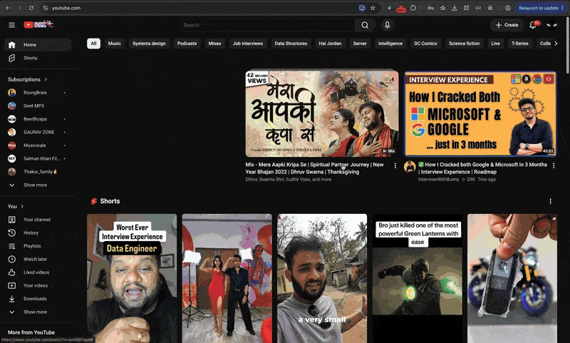

# Focusify

**Study topic in. Distractions out.**

Focusify is a Chrome extension that keeps YouTube on your topic. Tell it what you're studying or working on, and it hides videos that don't fit, so opening YouTube doesn't cost you an hour. Everything runs on your machine: no accounts, no servers, no tracking.

- [What it does](#what-it-does)
- [Install](#install) ([from a release](#option-a-download-a-release-easiest) · [from source](#option-b-clone-the-repository) · [Web Store](#option-c-chrome-web-store))
- [First-time setup](#first-time-setup)
- [Optional: local AI with Ollama](#optional-local-ai-with-ollama)
- [Using Focusify](#using-focusify)
- [How it decides](#how-it-decides)
- [Troubleshooting](#troubleshooting)
- [Development and releasing](#development-and-releasing)

<p align="center">
  
</p>

## What it does

| Feature | What you get |
|---|---|
| **Two filter styles** | *Strict* judges every video against your topic. *Discover* uses the same Sensitivity threshold, but lets the AI accept related and adjacent topics from new channels. See [Filter style](#filter-style-strict-or-discover). |
| **Topic-driven filtering** | Set a focus topic, keywords to boost and words to block. Nothing is preset, and it works for any subject. |
| **Invisible** | Videos stay hidden until they are checked, so distractions never flash on screen. |
| **Modes** | Always on, on a weekly schedule (overnight windows too), or off. "Pause 15 min" is one click away. |
| **No Shorts** | Hides Shorts in search, home and the sidebar (and the Shorts nav entry). `/shorts/…` links open in the normal player. |
| **Watching guard** | If the video you opened is off-topic, it's paused behind a "Go back / Watch anyway / Always allow this channel" prompt. |
| **No endless scrolling** | When a feed returns 40 off-topic videos in a row, Focusify stops loading more and offers "Load more anyway". |
| **Streaming-site blocker** | One switch blocks Netflix, Prime Video, JioHotstar, Disney+, Hulu, Max and more, plus any sites you add. Follows your schedule, pause and breaks. See [Blocking streaming sites](#blocking-streaming-sites). |
| **Optional local AI** | In Hybrid mode, borderline videos are double-checked by a model running on your own computer with [Ollama](https://ollama.com). Works fine without it. |
| **Everything else** | Channel allow/block lists, hide or blur, clickbait penalties, a Pomodoro timer that relaxes filters on breaks, and a log of what was blocked and why. |

## Install

Requires a Chromium browser with Manifest V3 support (Chrome, Edge, Brave, Arc). Firefox and Safari aren't supported yet.

### Option A: download a release (easiest)

1. Open the repository's **[Releases](../../releases)** page and download `focusify-yt-vX.Y.Z.zip` from the latest release.
2. **Unzip it** somewhere permanent. Chrome loads the extension from that folder, so don't delete it afterwards.
3. Open `chrome://extensions` and turn on **Developer mode** (top right).
4. Click **Load unpacked** and choose the unzipped folder (the one that contains `manifest.json`).
5. Click the puzzle-piece icon in the toolbar and **pin** Focusify.

> Chrome doesn't let you install a `.zip` or `.crx` file from outside the Web Store by dragging it in, which is why the steps above use "Load unpacked". To update, download the new release, replace the folder's contents, and click the reload icon on the extension's card.

### Option B: clone the repository

```bash
git clone https://github.com/shubhamcodess/focusify-yt.git
cd focusify-yt
```

Then follow steps 3-5 above, choosing the cloned `focusify-yt` folder in **Load unpacked**. To update later: `git pull`, then click reload on the extension card in `chrome://extensions`.

No `npm install` is needed to run the extension. Node is only used for tests and packaging.

### Option C: Chrome Web Store

Publishing is planned. Once it's live, the store page will be linked here, and installing will be one click with automatic updates.

## First-time setup

1. Click the Focusify icon.
2. On the **Focus** tab, type your topic (for example, "Organic chemistry") or tap a preset chip. Add a few **positive keywords** and any **distraction words** you want blocked.
3. Under **When to filter**, pick **Always**, **Schedule** (choose days and hours) or **Off**.
4. Click **Apply & Reload Page**, then open YouTube. Off-topic videos disappear.

That's all you need. The AI setup below is optional.

## Optional: local AI with Ollama

Without Ollama, Focusify uses its built-in logic engine (keywords, topic match, clickbait signals). If Ollama stops or isn't running, Focusify notices, skips it for a minute at a time (no slow waits), and falls back to the built-in matching automatically. The popup shows a notice, and the AI checks resume by themselves once Ollama is back. With Ollama, videos that the logic engine can't clearly judge are checked by a small local model, which is more accurate on unusual titles. Nothing leaves your computer.

1. **Install Ollama** from [ollama.com/download](https://ollama.com/download) (macOS, Windows or Linux).
2. **Download a model** (a small one is fine):

   ```bash
   ollama pull llama3.2:3b
   ```

3. **Make sure Ollama is running.** The desktop app runs it in the background; otherwise start it with:

   ```bash
   ollama serve
   ```

4. In Focusify, open the **Engine** tab. The status badge should read **Online**, and your model appears in the dropdown. Choose it.
5. Set the mode to **Hybrid** (recommended) or **Pure AI**, and click **Save**.

If the badge stays Offline or you see 403 errors, start Ollama with the extension origin allowed:

```bash
OLLAMA_ORIGINS="chrome-extension://*" ollama serve
```

## Using Focusify

- **Pause:** the *Pause 15 min* button suspends filtering; press it again to resume.
- **Channel lists (Rules tab):** whitelisted channels are always allowed, blacklisted channels are always blocked. In blur mode, each blocked card also has an "Allow Channel" button.
- **Sensitivity (Rules tab):** lower values let more related videos through; higher values are stricter.
- **Hide or blur:** hide removes cards completely; blur keeps them with a "Show Video" overlay.
- **Guard the video I'm watching (Rules tab):** turn off if you only want feed filtering.
- **Pomodoro:** during a break, filters relax automatically.
- **Takeaways chip:** allowed videos show a 💡 chip in the thumbnail's top-right corner. Hover or click it for a short AI summary (needs Ollama). Turn it off in the Rules tab.
- **Version:** the popup header shows the installed version in its bottom-right corner, which is handy when reporting issues.
- **Log tab:** see what was blocked and why, which is handy for tuning your keywords.

All defaults, including word lists, are plain data in [`scripts/defaults.js`](scripts/defaults.js). Topic presets live in [`scripts/presets.js`](scripts/presets.js). Both are safe to edit.

## Filter style: Strict or Discover

Set it in the **Rules** tab under **Filter style**.

| | Strict (default) | Discover |
|---|---|---|
| Videos scoring at or above your **Sensitivity** | Shown | Shown, with no AI call |
| Videos below it (Hybrid/AI mode, Ollama running) | Judged by the AI against your topic only | Judged by the AI, which also accepts related and adjacent topics |
| Can the AI override the threshold? | Yes | No: the AI's own score must also reach your threshold |
| Ollama off, or Logic mode | Logic verdict | Logic verdict |

Tips:

- A video with no topic signal at all scores about 45%. If those get through, raise **Sensitivity** to around 50.
- To widen your feed, lower Sensitivity or use Discover with Ollama running.

## When Ollama isn't running

Focusify keeps working. After one failed AI call it skips Ollama for a minute at a time, so pages don't slow down, and falls back to the built-in engine, which matches related word forms (for example "designing" and "design"). The popup shows a notice, and AI checks resume by themselves once Ollama is back. The off-topic prompt on a video page only appears for clear signals (a word or channel you blocked, or an AI verdict), never for a weak guess made without the AI.

## Blocking streaming sites

Open the **Sites** tab and turn on **Block streaming sites**. From then on, opening Netflix, Prime Video, JioHotstar, Disney+, Hulu, Max, Peacock, Paramount+, Apple TV+, SonyLIV, ZEE5, MX Player, Crunchyroll or discovery+ shows a Focusify page instead of the site.

- **Per site:** tap a site's chip to allow it (struck through) or block it. Add any other site in **Other sites**, one per line.
- **Same rules as the filter:** blocking follows *Always / Schedule / Off*, *Pause 15 min*, and Pomodoro breaks. Outside your schedule, nothing is blocked.
- **Already-open tabs:** when blocking switches on (for example, when your schedule starts), open tabs of those sites move to the blocked page.
- **Getting around it:** the blocked page offers "Pause Focusify for 15 min" after a short wait (`siteUnlockDelaySec`, 10 s by default). It pauses the YouTube filter as well.
- **Permission prompt:** the first time you switch it on, Chrome asks to let Focusify "read and change data on" the listed sites. That's what lets it show its own page instead of a browser error. If you decline, the sites are still blocked, but Chrome shows a plain "blocked by client" error. Focusify never reads those pages; it only redirects them.

The site list is plain data in [`scripts/sites.js`](scripts/sites.js).

## How it decides

1. **Channel lists** win first (allow or block).
2. **Blocked words** in the title or channel block a video.
3. The **logic engine** scores relevance from your topic, positive keywords, educational signal words and clickbait phrases.
4. In **Hybrid** mode, only ambiguous scores are sent to the AI. Decisions are cached.

The engine itself has no topic-specific vocabulary; everything comes from your settings.

## Privacy

No accounts, analytics or servers. Settings and statistics stay in your browser. If you enable an AI mode, video titles and channel names go only to the Ollama endpoint you configure (by default, your own computer). See the [privacy policy](docs/privacy-policy.md).

## Troubleshooting

| Problem | Try |
|---|---|
| Nothing gets filtered | Check the master switch and "When to filter" aren't Off or Paused, and that a topic is set. Reload the YouTube tab. |
| Everything is blocked | Lower **Sensitivity** on the Rules tab, and check your distraction words aren't too broad. |
| Unrelated videos still show ("Logic 45%") | General content scores about 45%. Raise **Sensitivity** to around 50 in the Rules tab. |
| Too much gets through | Add distraction words, raise Sensitivity, or use Hybrid mode with Ollama. |
| Ollama shows Offline | Confirm it's running (`ollama list`), the endpoint is `http://localhost:11434`, and try the `OLLAMA_ORIGINS` command above. |
| A blocked site shows a plain error page | You skipped the permission prompt. Open **Sites** and click **Allow friendly blocked page**. The site is still blocked. |
| A streaming site isn't blocked | Check **Block streaming sites** is on, the site's chip is highlighted (not struck through), and it's within your schedule, not paused or on a break. |
| Shorts still show up | YouTube changes its markup often. Open an issue with a screenshot. |
| Extension broke after an update | Click the reload icon on its card at `chrome://extensions`. |

## Development and releasing

```bash
npm test         # unit tests (Node's built-in runner, no dependencies)
npm run build    # writes dist/focusify-yt-v<version>.zip
```

| Path | Purpose |
|---|---|
| `scripts/content.js` | Page filtering, activation, Shorts, watch guard, feed patience |
| `scripts/background.js` | Ollama calls, decision cache, stats, header rule |
| `scripts/logic-engine.js` | Pure, dependency-free scoring |
| `scripts/defaults.js` | Config defaults, schedule and activation logic |
| `scripts/presets.js` | Topic presets (data) |
| `scripts/sites.js` | Streaming-site presets and domain helpers (data) |
| `scripts/site-blocker.js` | Keeps the site-blocking rules in sync with your settings |
| `blocked/` | The page shown in place of a blocked site |
| `popup/` | Settings UI |
| `docs/` | Store listing and privacy policy |
| `tests/` | Unit tests |

**Continuous builds.** Every push and pull request runs the tests and uploads the built zip as a workflow artifact (Actions tab, open a run, see *Artifacts*).

**Cutting a release.** Downloads for users come from GitHub Releases, created automatically when you push a version tag:

1. Bump `version` in **both** `manifest.json` and `package.json` (a test checks they match) and add a note to [CHANGELOG.md](CHANGELOG.md).
2. Commit, then tag and push:

   ```bash
   git tag v1.1.0
   git push origin main v1.1.0
   ```

3. The **Release** workflow runs the tests, checks the tag matches the manifest, builds the zip, and attaches it to a new GitHub Release.

**Publishing to the Chrome Web Store.** Upload the same zip in the [Developer Dashboard](https://chrome.google.com/webstore/devconsole). Copy for the listing, permission justifications and privacy answers are in [docs/store-listing.md](docs/store-listing.md).

## Limitations

- YouTube changes its markup often; selectors are near the top of `scripts/content.js`.
- The Ollama header rule (in `scripts/background.js`) is built from the default endpoint's port (11434). For another port, change `ollamaEndpoint` in `scripts/defaults.js` and `host_permissions` in `manifest.json`.

## License

[MIT](LICENSE)
